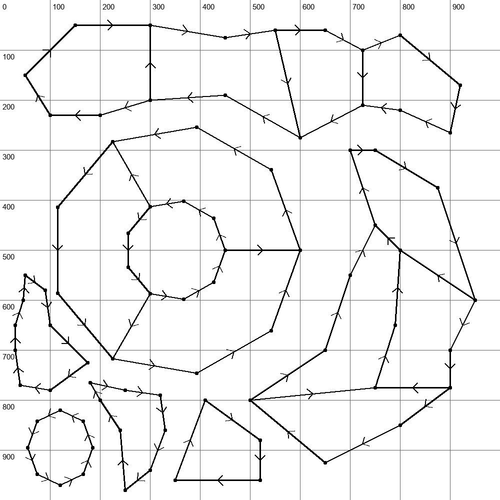
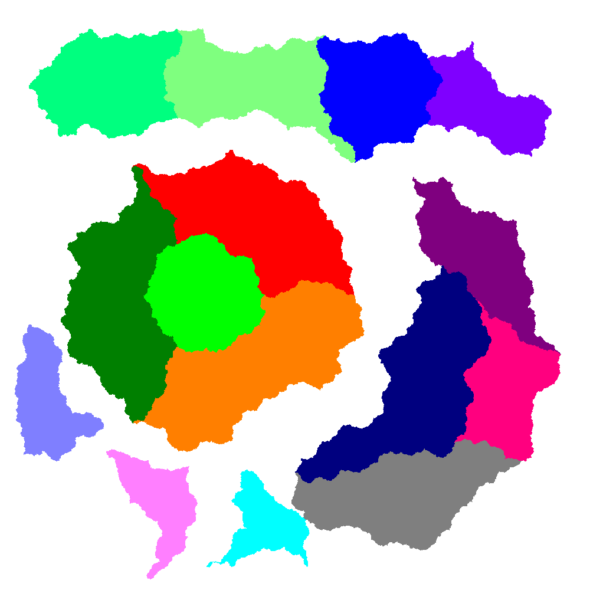

# Map Generator

The 'map_generator.py' file allows a user to define a set of coordinates and mutiple sets of vectors between those coordinates to form 'regions' of a 'map'. The code takes the coordinates and uses random fractal methods to give the borders of the regions a more realistic look (realistic of borders in Europe, not of North America or Africa). The code also allows the input of other data such as a colour and name for each region, and the ability to create parent-child relationships between regions. This information is used to help generate the output, which will include unique integer IDs for each region.

This tool is a great example of why you document your own work (even for just yourself, when you're reading it 6 months later) and don't implement lazy solutions that will break when you try and make the slightest adjustments to your code.

It also emphasises why modularising your code is useful and important, something that is done here to some extent (many parts are split into different methods) but could be done much better. Modularisation keeps the project in manageable chunks, so that making edits in the future is much more painless, and any useful modules can also be reused.

The 'example_output' folder shows an example of output that can be expected from the tool.

| Input | Output |
|:-:|:-:|
|  |  |

