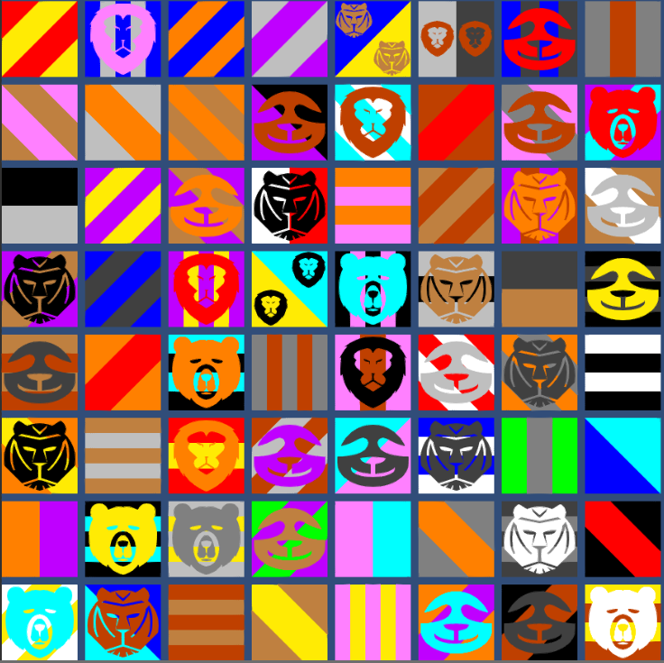

# Sigil Generator

The 'Sigil Generator' tool is used to generate a 'Sigil' for an entity.

That entity could be (with real-life equivalent examples):

- A House (such as the historic House of York)
- A Competition (such as the English Premier League)
- A Region (such as Derbyshire)
- A Squadron (such as Manchester United FC)

In this area, you will find:
- The 'classes' folder, which contains a collection of C# scripts used to render the Sigils in Unity
- The 'data_generator' folder, which contains a collection of Python scripts used to generate JSON files which define Sigils.
- The 'sigil_items' folder, which contains examples of images which can be used as 'Items' on a Sigil.
- A 'sigils_preview.png' file, which is an 8 by 8 grid of 64 different randomly generated Sigils.

You will notice that the Sigils in the preview file do not have too much variety and are offensively colourful. This is because the only types of patterns implemented so far are striped patterns, and only 4 possible Items are available for the Sigils, however both of these things can be expanded for wider variety.

As for the offensive colours, a better colour pallete can simply be chosen, perhaps by defining the available colours in terms of HSV and limiting the V aspect to 50%, to give a darker, more medieval feel to the Sigils.

